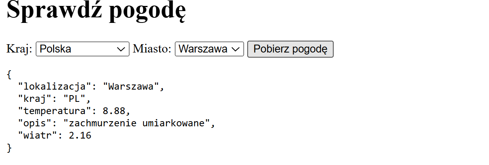
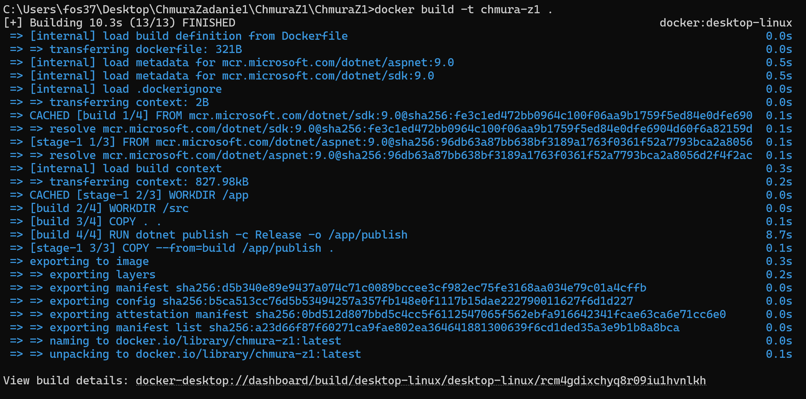
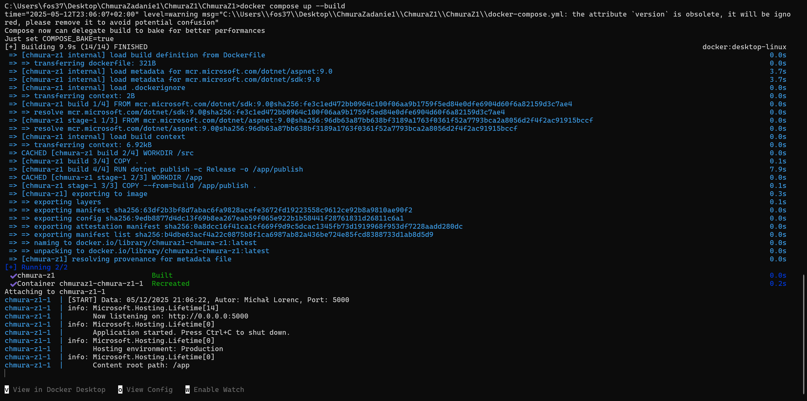
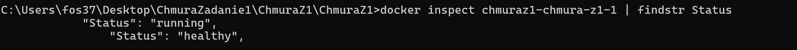

# ChmuraZ1 – Aplikacja pogodowa (Docker + .NET 9 + OpenWeatherMap)

Projekt wykonany w ramach laboratorium **Programowanie Aplikacji w Chmurze Obliczeniowej**.

## 🔧 Funkcjonalność

- Logowanie daty uruchomienia, autora i portu
- Interfejs HTML (`index.html`) z dynamicznym wyborem kraju i miasta
- Pobieranie danych pogodowych z OpenWeatherMap API
- Endpoint `/weather` – zwraca dane pogodowe w JSON
- Endpoint `/health` – wykorzystywany przez `HEALTHCHECK` Dockera
- Obsługa przez `docker-compose`
- HEALTHCHECK oparty o `curl`

## 🐳 Docker

### Budowanie:

```bash
docker compose build
```

### Uruchomienie:

```bash
docker compose up
```

### Healthcheck:

```bash
docker inspect <container_id> | findstr Status
```

## 🌐 UI

Dostępne pod `http://localhost:5000`  
Zbudowane w czystym HTML + JavaScript (bez frameworków)

## 🖼️ Zrzuty ekranu

- ✅ Widok działania aplikacji w przeglądarce (`http://localhost:5000`)
  

- ✅ Terminal z `docker build`
  

- ✅ Terminal z `docker compose up`
  

- ✅ Healthcheck – `docker inspect` pokazujący `"Status": "healthy"`
  

- ✅ Widok logów (`docker logs <container_id>`)
  

## 🔗 Linki

- DockerHub: https://hub.docker.com/r/LLRNC/chmuraz1
- GitHub: https://github.com/LLRNC/chmuraz1

## 📁 Struktura katalogu

```
ChmuraZ1/
├── Program.cs
├── ChmuraZ1.csproj
├── Dockerfile
├── docker-compose.yml
├── zadanie1.md
├── zadanie1_dod.md
├── README.md
├── wwwroot/
│   └── index.html
└── screens/
    ├── ui.png
    ├── build.png
    ├── compose.png
    ├── health.png
    └── logs.png
```

---
